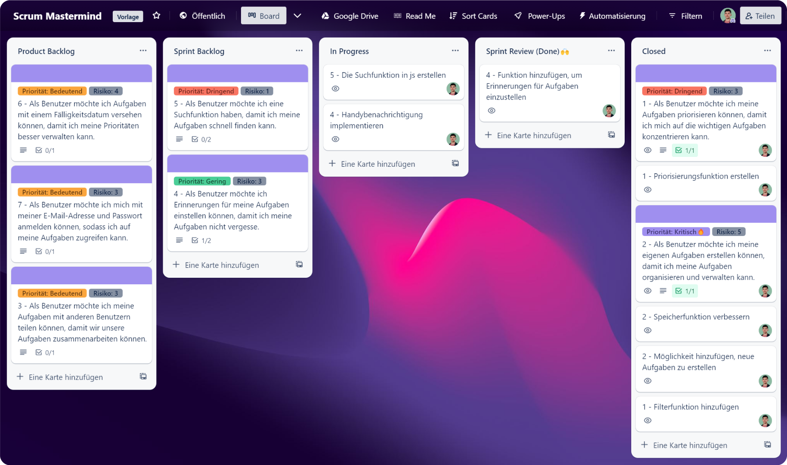

# 👋 Willkommen

<figure><figcaption>
<a href="https://trello.com/b/IGeT9eAx/">https://trello.com/b/IGeT9eAx/</a>
</figcaption></figure>

Du bist hier richtig, wenn Du effektiver und erfolgreicher mit Deinen Scrum-Projekten arbeiten möchtest. Das Trello Board Template bietet Dir eine intuitive und leicht verständliche Möglichkeit, Deine Aufgabenliste und Projektdetails einfach im Blick zu behalten und die Zusammenarbeit im Team zu optimieren.

## Warum ist dieses Trello-Template sinnvoll?

1. Du sparst Zeit, da das Board bereits vorgefertigt ist.
2. Du erhältst Vorlagen für Cards von User Stories und Tasks.
3. Es gibt eine automatische Sortierung, die Dir eine effiziente Strukturierung des Boards ermöglicht.
4. Du hast einen zusätzlichen Bereich für Projektbeschreibungen, um wichtige Informationen übersichtlich darzustellen.
5. Du kannst Dokumente direkt von Google Drive in das Board hochladen

Ich verstehe, dass jeder von Euch ein solches Board selbst erstellen kann, aber das Ziel dieses Templates ist es, Zeit zu sparen.

## Los geht's!

Wenn Du gerade erst mit dem Trello Board Template beginnst, empfehle ich Dir, zuerst unser **Schnellstart** zu lesen. Hier findest Du alle Schritte, die Du benötigst, um das Template in kürzester Zeit einzurichten und mit Deiner Arbeit zu beginnen.


[schnellstart.md](schnellstart.md)


## Tipps & Tricks

In der **Tipps & Tricks** Seite findest Du zahlreiche nützliche Ratschläge, wie Du das Trello Board Template noch besser nutzen möchtest.


[Broken link](broken-reference)


## Fragen & Feedback

Hast Du Fragen oder Feedback zur Verbesserung des Trello Board Templates für Scrum-Projekte? Her damit! Ich freue mich über Dein Feedback und helfe Dir gerne weiter. Schreibe mir einfach eine E-Mail an [**Hossaini.h03@htlwienwest.at**](mailto:Hossaini.h03@htlwienwest.at?subject=ITP%20SCRUM%20Template) oder Du kannst meine Webseite [**Hossaini.dev**](https://hossaini.dev/) besuchen, um weitere Kontaktmöglichkeiten zu finden.


