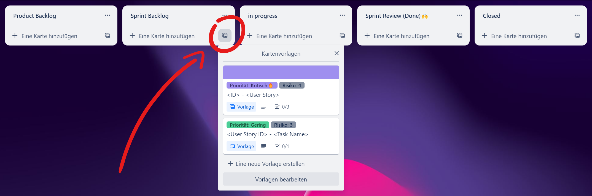

# Trello Board

Dieses Template ist perfekt für alle, die ein Scrum-Projekt erfolgreich managen möchten. Hier zeige ich Dir, wie Du das Board verwenden kannst:

## Spalten

Das Template besteht aus fünf Spalten, die jeweils verschiedene Phasen des Scrum-Prozesses darstellen: Product Backlog, Sprint Backlog, In Progress, Sprint Review (Done)🙌 und Closed.

<figure><figcaption></figcaption></figure>

## Kartenvorlagen

Ich empfehle Dir, Karten aus Kartenvorlagen zu erstellen. Dazu gibt es zwei Kartenvorlagen: Eine für User Stories und eine für Tasks.

<figure><figcaption></figcaption></figure>



Wenn Du eine User Story aus der Kartenvorlage erstellst, gib zuerst die ID der User Story ein, gefolgt von einem Bindestrich und dann der eigentlichen User Story. Die Priorität einer User Story kann mit einem der folgenden Labels angegeben werden: "Gering", "Regulär", "Bedeutend", "Dringend" oder "Kritisch 🔥". Das Risiko kann mit einer Zahl zwischen 1 und 5 dargestellt werden. Je höher die Zahl, desto höher ist das Risiko. In der Beschreibung kannst Du die Story Points und Post Story Points in der bekannten Fibonacci-Folge von 1 bis 13 angebenAußerdem gibt es drei Checklisten für Akzeptanzkriterien, Definition of Done und Done.

<figure><figcaption></figcaption></figure>



Wenn Du einen Task aus der Kartenvorlage erstellst, gib zuerst die User Story ID ein, damit Du eine visuelle Verbindung hast, und dann den Namen des Tasks. Die Priorität eines Tasks kann mit einem der folgenden Labels angegeben werden: "Gering", "Regulär", "Bedeutend", "Dringend" oder "Kritisch 🔥". Das Risiko kann mit einer Zahl zwischen 1 und 5 dargestellt werden. Je höher die Zahl, desto höher ist das Risiko. In der Beschreibung kannst Du die Story Points und Post Story Points in der bekannten Fibonacci-Folge von 1 bis 13 angeben. Außerdem gibt es eine Checkliste für die Definition of Done.

<figure><figcaption></figcaption></figure>



Um einer Karte beizutreten, klicke einfach auf den Button "Karte beitreten". Wenn Du etwas hochladen möchtest, nutze den Power-Up "Google Drive". Besuche die Seite zur Automatisierung und Power-Ups, um weitere Informationen zu erhalten.


[automatisierung.md](automatisierung.md)



[power-ups.md](power-ups.md)


## Fragen & Feedback

Ich hoffe, dass Dir diese Informationen helfen, das ITP Scrum Template erfolgreich zu nutzen. Wenn Du weitere Fragen hast oder Feedback geben möchtest, zögere nicht, mich zu kontaktieren. Schreibe mir einfach eine E-Mail an [**Hossaini.h03@htlwienwest.at**](mailto:Hossaini.h03@htlwienwest.at?subject=ITP%20SCRUM%20Template) oder Du kannst meine Webseite [**Hossaini.dev**](https://hossaini.dev/) besuchen, um weitere Kontaktmöglichkeiten zu finden.


