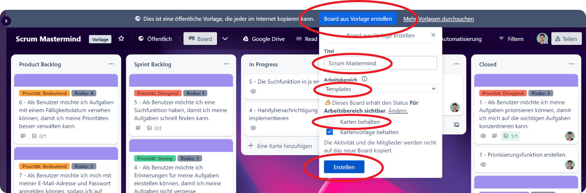

# 🚀 Schnellstart

Möchtest Du sofort mit dem Scrum Mastermind Template loslegen? Hier ist eine kurze Anleitung, die Dir dabei helfen wird:


Damit du die Anleitung umsetzen kannst, musst du bei Trello angemeldet sein.


1. Öffne den [**Scrum Mastermind Template**](https://trello.com/b/IGeT9eAx/) Link
2. Klicke auf den Button **"Board aus Vorlage erstellen"**
   * Gib einen Titel für dein Board ein.
   * Wähle den Arbeitsbereich aus, in dem das Board erstellt werden soll.
   * Achte darauf, die Option "Karten behalten" nicht aktiviert ist.
3.  Klicke auf **"Erstellen"**

    <figure><figcaption></figcaption></figure>


Achtung: Bevor Du Karten erstellst, schau unbedingt auf der Seite [**Trello Board**](scrum-mastermind/trello-board.md) vorbei, um das meiste aus dem Template herauszuholen.



[trello-board.md](scrum-mastermind/trello-board.md)

