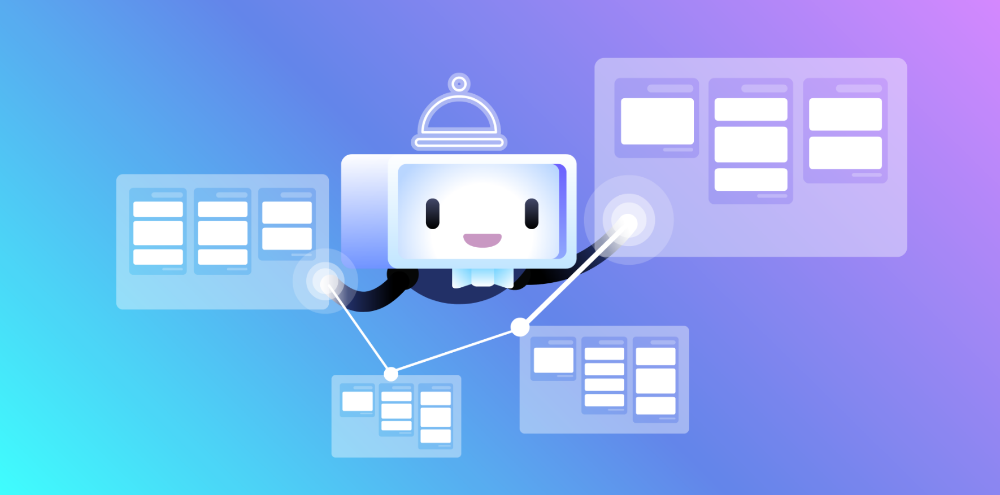
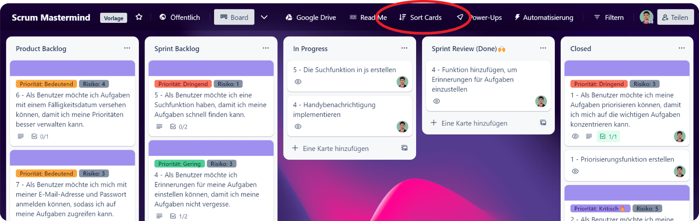
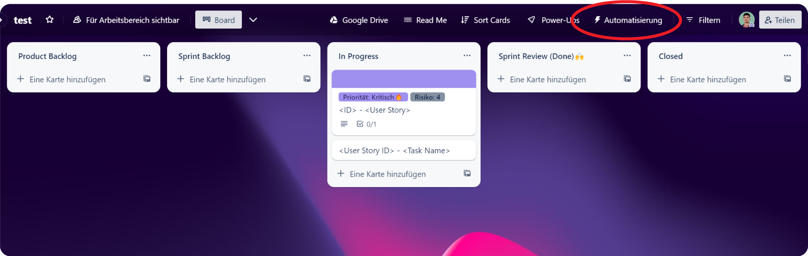

# Automatisierung

<figure><figcaption>
Bild Quelle: <a href="https://blog.trello.com/de/prozessautomatisierung">https://blog.trello.com/de/prozessautomatisierung</a>
</figcaption></figure>

Wenn Du ein agiles Scrum-Projekt mit Trello verwaltest, möchtest Du Dich darauf konzentrieren, Deine Aufgaben schnell und effizient zu erledigen. Die Automatisierung von Trello hilft Dir dabei, indem es die Sortierung von Karten automatisch übernimmt.

## Buttons

### Automatische Sortierung

Es gibt einen speziellen Button, der für die Sortierung aller Karten auf dem Board zuständig ist. Wenn Du diesen Button anklickst, werden die Karten auf dem Board automatisch nach Priorität, Risiko und Zeit sortiert. Die Karten behalten ihre Sortierung bei, bis der "Sortierungs-Button" erneut betätigt wird - auch wenn Änderungen an den Karten vorgenommen werden.

<figure><figcaption></figcaption></figure>

### Karte beitreten

Zusätzlich gibt es einen praktischen "Karte beitreten"-Button, mit dem Du mühelos einer Karte beitreten kannst.

## Eigene Automatisierung

Wenn Du spezifische Anforderungen hast, die über die bereits vorhandenen Regeln hinausgehen, kannst Du auch Deine eigenen Automatisierungsregeln erstellen. Das ist ganz einfach - klicke einfach auf den entsprechenden Button (⬇️siehe Screenshot⬇️) und lege Deine eigenen Regeln fest. So kannst Du Deine Arbeit noch effektiver gestalten und Dich auf das Wesentliche konzentrieren.

<figure><figcaption></figcaption></figure>

