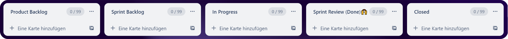
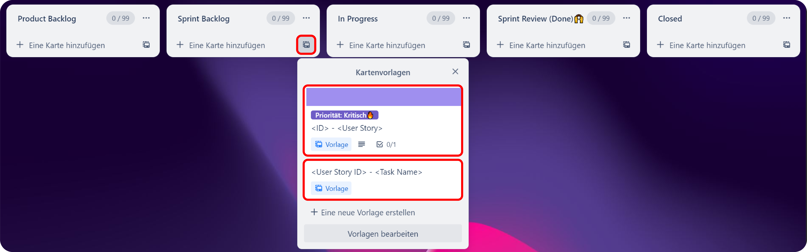
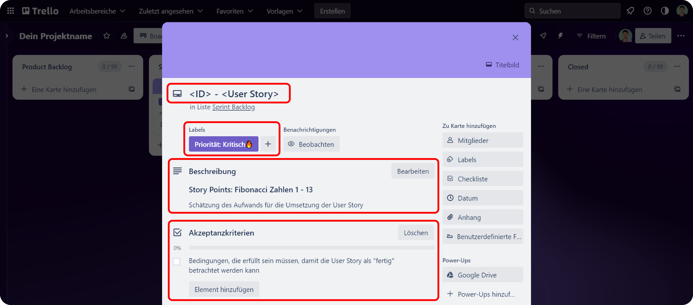
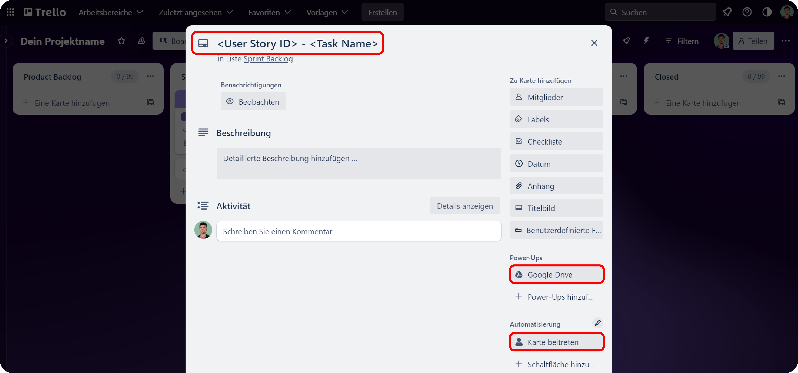

# Trello Board

Dieses Template ist perfekt für alle, die ein Scrum-Projekt erfolgreich managen möchten. Hier zeige ich Dir, wie Du das Board verwenden kannst:

## Spalten

Das Template besteht aus fünf Spalten, die jeweils verschiedene Phasen des Scrum-Prozesses darstellen: Product Backlog, Sprint Backlog, In Progress, Sprint Review (Done)🙌 und Closed.

<figure><figcaption></figcaption></figure>

## Kartenvorlagen

Ich empfehle Dir, Karten aus Kartenvorlagen zu erstellen. Dazu gibt es zwei Kartenvorlagen: Eine für User Stories und eine für Tasks.

<figure><figcaption></figcaption></figure>



Wenn Du eine User Story aus einer Kartenvorlage erstellst, solltest Du folgende Schritte beachten:

* Gib zuerst die ID der User Story ein, gefolgt von einem Bindestrich und anschließend der eigentlichen User Story.
* Verwende eines der folgenden Labels, um die Priorität der User Story anzugeben: "Gering", "Regulär", "Bedeutend", "Dringend" oder "Kritisch 🔥".
* Nutze die Beschreibung, um die Story Points in der bekannten Fibonacci-Folge von 1 bis 13 anzugeben.
* Verwende außerdem das Checklist, um Akzeptanzkriterien für die User Story festzulegen.

<figure><figcaption></figcaption></figure>



Wenn Du einen Task aus einer Kartenvorlage erstellen möchtest, solltest Du folgende Schritte beachten:

* Gib zuerst die ID der zugehörigen User Story ein, damit eine visuelle Verbindung hergestellt wird, und anschließend den Namen des Tasks.
* Wenn Du einem bereits existierenden Task beitreten möchtest, klicke auf die Schaltfläche "Karte beitreten".
* Falls Du ein Dokument aus Google Drive anhängen möchtest, klicke auf die Schaltfläche "Google Drive".

<figure><figcaption></figcaption></figure>



Besuche die Seite zur Automatisierung und Power-Ups, um weitere Informationen zu erhalten.


[automatisierung.md](automatisierung.md)



[power-ups.md](power-ups.md)


## Fragen & Feedback

Ich hoffe, dass Dir diese Informationen helfen, das Template erfolgreich zu nutzen. Wenn Du weitere Fragen hast oder Feedback geben möchtest, zögere nicht, mich zu kontaktieren. Schreibe mir einfach eine E-Mail an [**Hossaini.h03@htlwienwest.at**](mailto:Hossaini.h03@htlwienwest.at?subject=ITP%20SCRUM%20Template) oder Du kannst meine Webseite [**Hossaini.dev**](https://hossaini.dev/) besuchen, um weitere Kontaktmöglichkeiten zu finden.


