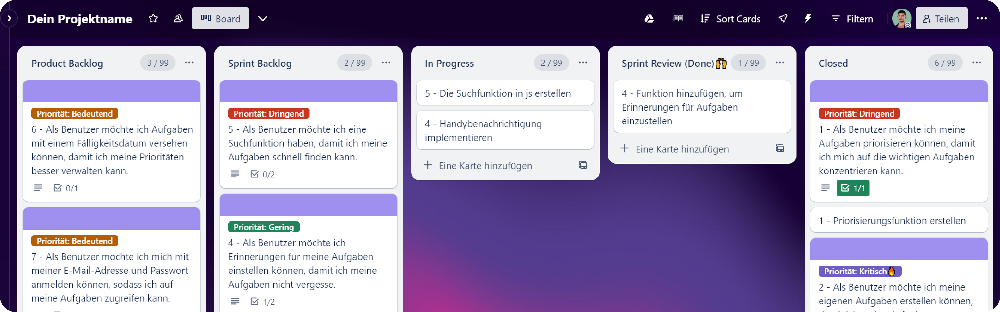

# Design

Hier zeige ich Dir, wie Du das Beste aus Trello herausholen kannst. Mit diesen einfachen Tricks und nützlichen Tipps kannst Du Deine Trello-Erfahrung optimieren und produktiver arbeiten.

## Tipp 1:  Labels (Priorität) besser erkennen

In Trello können Labels dazu genutzt werden, um Prioritäten von Aufgaben zu kennzeichnen. Aber wenn Du nur die farbigen Blöcke auf Deinem Board siehst, kann es schwierig sein, die genaue Bedeutung zu verstehen. Hier ist ein Tipp, wie Du die Labels besser erkennen kannst:

Klicke einfach auf ein Label, um den Text darin anzuzeigen. Auf diese Weise kannst Du schnell sehen, welche Bedeutung jedes Label hat und Deine Arbeit noch effektiver planen. Schau Dir den Screenshot an, um zu sehen, wie es aussieht.

<figure><figcaption></figcaption></figure>
